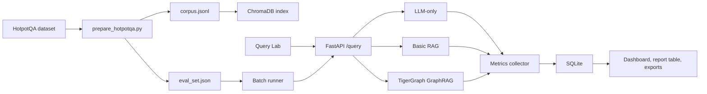

# Architecture

## Goal

GraphRAG Benchmark Lab measures whether TigerGraph GraphRAG can reduce prompt tokens and estimated cost compared with Basic RAG while preserving answer quality on HotpotQA-style multi-hop QA.

## System Flow

## Backend Modules

- `backend/app/services/llm.py`: provider abstraction for mock, OpenAI-compatible, and Ollama chat completions.
- `backend/app/retrieval/vector.py`: Basic RAG retriever using ChromaDB when available and labelled lexical fallback when not.
- `backend/app/retrieval/tigergraph.py`: TigerGraph GraphRAG adapter. It supports `pyTigerGraph` and a configurable HTTP endpoint.
- `backend/app/pipelines`: three pipeline implementations plus the runner that executes and compares them.
- `backend/app/evaluation/evaluator.py`: BERTScore, answer recall, exact match, and LLM-as-a-Judge integration.
- `backend/app/storage/database.py`: SQLite persistence for every run and pipeline result.

## Metrics

Each pipeline returns:

- Prompt tokens
- Completion tokens
- Total tokens
- Latency in milliseconds
- Estimated cost in USD
- LLM-as-a-Judge label, score, and reasoning when available
- BERTScore F1 when Hugging Face evaluation is installed and ground truth is provided
- Exact match and answer recall when ground truth is provided

## Honesty Model

The lab does not create fake live metrics. It uses three explicit states:

- `live`: all necessary external services for that pipeline responded.
- `dev`: local deterministic or lexical fallback was used.
- `mixed`: a live generation path used a fallback retriever or evaluator.

Warnings are stored with every pipeline result so exported reports preserve the conditions of each run.

## TigerGraph Integration

The adapter follows the public TigerGraph GraphRAG demo shape:

1. Create a `TigerGraphConnection`.
2. Set `conn.graphname`.
3. Call `conn.ai.configureGraphRAGHost(TIGERGRAPH_GRAPHRAG_URL)`.
4. Call `conn.ai.answerQuestion(question, method="hybrid", method_parameters=...)`.

For deployments that expose GraphRAG over HTTP, set `TIGERGRAPH_GRAPHRAG_URL` and `TIGERGRAPH_GRAPHRAG_PATH`.

